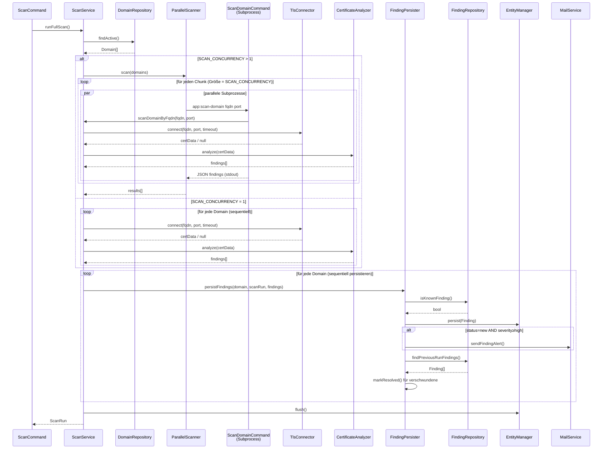

# Architektur-Dokumentation – crySSLCheck / TLS Monitor

## Refactoring-Status (2026-02-26)

### Abgeschlossene Extraktionen

| Extraktion | Quell-LOC | Neue Klasse | Tests |
|------------|-----------|-------------|-------|
| ScanConfiguration VO | 5 Konstruktor-Params | `ValueObject\ScanConfiguration` | 3 |
| CertificateAnalyzer | ~130 LOC aus ScanService | `Service\CertificateAnalyzer` | 30+ |
| TlsConnector | ~150 LOC aus ScanService | `Service\TlsConnector` + `TlsConnectorInterface` | 3 |
| FindingPersister | ~60 LOC aus ScanService | `Service\FindingPersister` | 17 |
| ParallelScanner | Neuer Service | `Service\ParallelScanner` | 8 |
| Enums | String-Literale überall | 5 Enums in `Enum\` | – |

### ScanService-Reduktion

| Metrik | Vorher | Nachher |
|--------|--------|---------|
| LOC | 517 | ~150 |
| Verantwortlichkeiten | 5 (TLS, Analyse, Persistence, Mail, Orchestration) | 1 (Orchestration) |
| Direkte Dependencies | 8 | 6 |
| Unmockbare Aufrufe | `stream_socket_client`, `openssl_*`, `sleep` | nur `sleep` (Retry) |

### PHPStan

- Level: **6** (erhöht von 5)
- Baseline: 44 Fehler (hauptsächlich `missingType.iterableValue` – Array-PHPDoc)

### Enums

| Enum | Werte | Einsatzort |
|------|-------|------------|
| `FindingType` | OK, CERT_EXPIRY, TLS_VERSION, CHAIN_ERROR, RSA_KEY_LENGTH, UNREACHABLE, ERROR | Services, Repositories |
| `Severity` | ok, low, medium, high, critical | Services, Entity (Badge) |
| `FindingStatus` | new, known, resolved | FindingPersister, Entity, Repository |
| `DomainStatus` | active, inactive | Entity, Repository, Controller |
| `ScanRunStatus` | running, success, partial, failed | Entity, ScanService, ScanCommand, Repository |

### Test-Coverage (nach Refactoring)

| Bereich | Lines | Methods |
|---------|-------|---------|
| **Gesamt** | **72.5 %** (869/1198) | **77.0 %** (124/161) |
| Entity | 100.0 % (92/92) | 100.0 % (59/59) |
| ValueObject | 100.0 % (18/18) | 100.0 % (4/4) |
| Security | 100.0 % (11/11) | 100.0 % (4/4) |
| CertificateAnalyzer | 100.0 % (85/85) | 100.0 % (8/8) |
| FindingPersister | 100.0 % (48/48) | 100.0 % (2/2) |
| ValidationService | 100.0 % (37/37) | 100.0 % (6/6) |
| Repository | 90.5 % (114/126) | 84.2 % (16/19) |
| Controller | 81.1 % (317/391) | 46.2 % (12/26) |
| MailService | 79.0 % (79/100) | 72.7 % (8/11) |
| TlsConnector | 32.7 % (34/104) | 20.0 % (1/5) |
| ScanService | 4.1 % (3/74) | 25.0 % (1/4) |

> **Hinweis:** `ScanService` und `TlsConnector` haben niedrige Line-Coverage, da ihre Logik in Unit-Tests über Mocks getestet wird. Die extrahierten Klassen (CertificateAnalyzer, FindingPersister) sind zu 100 % abgedeckt.

---

## Abhängigkeitsgraph

```mermaid
graph TD
    subgraph Commands
        ScanCommand["ScanCommand"]
        CreateUserCommand["CreateUserCommand"]
    end

    subgraph Controllers
        DomainController["DomainController"]
        FindingController["FindingController"]
        ScanController["ScanController"]
        SecurityController["SecurityController"]
        UserController["UserController"]
        HealthController["HealthController"]
    end

    subgraph Services
        ScanService["ScanService<br/>(~180 LOC – Orchestrator)"]
        ParallelScanner["ParallelScanner<br/>(~170 LOC)"]
        CertificateAnalyzer["CertificateAnalyzer<br/>(~130 LOC)"]
        TlsConnector["TlsConnector<br/>(~150 LOC)"]
        FindingPersister["FindingPersister<br/>(~60 LOC)"]
        MailService["MailService<br/>(~207 LOC)"]
        ValidationService["ValidationService<br/>(~106 LOC)"]
    end

    subgraph ValueObjects
        ScanConfig["ScanConfiguration<br/>(readonly VO)"]
    end

    subgraph Enums
        FindingTypeEnum["FindingType"]
        SeverityEnum["Severity"]
        FindingStatusEnum["FindingStatus"]
        DomainStatusEnum["DomainStatus"]
        ScanRunStatusEnum["ScanRunStatus"]
    end

    subgraph Repositories
        DomainRepo["DomainRepository"]
        FindingRepo["FindingRepository"]
        ScanRunRepo["ScanRunRepository"]
        UserRepo["UserRepository"]
    end

    subgraph Entities
        Domain["Domain"]
        Finding["Finding"]
        ScanRun["ScanRun"]
        User["User"]
    end

    subgraph External
        StreamSocket["stream_socket_client<br/>(PHP built-in)"]
        OpenSSL["openssl_* functions"]
        Mailer["Symfony Mailer"]
    end

    %% ScanService (Orchestrator)
    ScanCommand --> ScanService
    ScanService --> DomainRepo
    ScanService --> ScanRunRepo
    ScanService --> CertificateAnalyzer
    ScanService --> TlsConnector
    ScanService --> FindingPersister
    ScanService --> ParallelScanner

    %% Parallel scanning
    ParallelScanner --> ScanDomainCmd["ScanDomainCommand<br/>(subprocess)"]
    ScanDomainCmd --> ScanService

    %% Extracted services
    TlsConnector --> StreamSocket
    TlsConnector --> OpenSSL
    FindingPersister --> FindingRepo
    FindingPersister --> MailService
    MailService --> Mailer

    %% Config injection
    ScanConfig -.-> ScanService
    ScanConfig -.-> CertificateAnalyzer
    ScanConfig -.-> FindingPersister
    ScanConfig -.-> ParallelScanner

    %% Controller dependencies
    DomainController --> DomainRepo
    DomainController --> ValidationService
    FindingController --> FindingRepo
    FindingController --> ScanRunRepo
    ScanController --> ScanService
    ScanController --> ScanRunRepo
    UserController --> UserRepo
    UserController --> ValidationService
    HealthController --> MailService
    ValidationService --> DomainRepo

    %% Enum usage (dotted)
    FindingTypeEnum -.-> CertificateAnalyzer
    FindingTypeEnum -.-> ScanService
    FindingTypeEnum -.-> FindingPersister
    SeverityEnum -.-> CertificateAnalyzer
    SeverityEnum -.-> FindingPersister
    FindingStatusEnum -.-> FindingPersister
    DomainStatusEnum -.-> Domain
    ScanRunStatusEnum -.-> ScanRun

    %% Styling
    style ScanService fill:#69db7c,stroke:#2b8a3e
    style CertificateAnalyzer fill:#74c0fc,stroke:#1971c2
    style TlsConnector fill:#74c0fc,stroke:#1971c2
    style FindingPersister fill:#74c0fc,stroke:#1971c2
    style MailService fill:#ffd43b,stroke:#f08c00
    style ValidationService fill:#69db7c,stroke:#2b8a3e
```

### Datenfluss: Scan-Zyklus

---

## Risiko-Hotspots (aktualisiert)

### Erledigte Hotspots

| # | Problem | Lösung |
|---|---------|--------|
| 1 | ScanService 517-LOC-Monolith | → ~150 LOC Orchestrator, 4 Extraktionen |
| 2 | Unmockbare `stream_socket_client`/`openssl_*` | → TlsConnectorInterface, komplett mockbar |
| 3 | Gemischte Persistence/Mail-Logik | → FindingPersister extrahiert |
| 4 | 5+ verstreute Env-Parameter | → ScanConfiguration Value Object |
| 5 | Magische String-Literale überall | → 5 typsichere Enums |

### Verbleibende Verbesserungsmöglichkeiten

| Prio | Bereich | Problem | Risiko |
|------|---------|---------|--------|
| 1 | PHPStan-Baseline | 44 Fehler (fehlende Array-PHPDoc-Typen) | **Niedrig** |
| 2 | `sleep()` in `scanDomain()` | Nicht mockbar, verlangsamt Tests | **Niedrig** |
| 3 | MailService | 79 % Coverage, Inline-Template-Building | **Niedrig** |
| 4 | UserRepository | 40 % Coverage | **Niedrig** |

### Unmockbare Abhängigkeiten

- `sleep()` – in `ScanService::scanDomain()` Retry-Logik (einzige verbleibende)
- ~~`stream_socket_client()`~~ → hinter `TlsConnectorInterface`
- ~~`openssl_x509_parse()`, `openssl_pkey_get_public()`~~ → in `TlsConnector` gekapselt

### Abgeschlossene Extraktionsreihenfolge

1. ✅ **`ScanConfiguration`** ← Value Object für 5 Env-Parameter
2. ✅ **`CertificateAnalyzer`** ← `checkCertExpiry()` + `checkTlsVersion()` + `checkChainError()` + `checkRsaKeyLength()` + `buildOkFinding()` + `computeDaysRemaining()`
3. ✅ **`TlsConnectorInterface` / `TlsConnector`** ← `performTlsCheck()` + `extractCertificateInfo()` + `extractPublicKeyInfo()` + `extractStreamMetadata()`
4. ✅ **`FindingPersister`** ← `persistFindings()` inkl. Mail-Alert-Entscheidungslogik
5. ✅ **5 Enums** ← `FindingType`, `Severity`, `FindingStatus`, `DomainStatus`, `ScanRunStatus`
